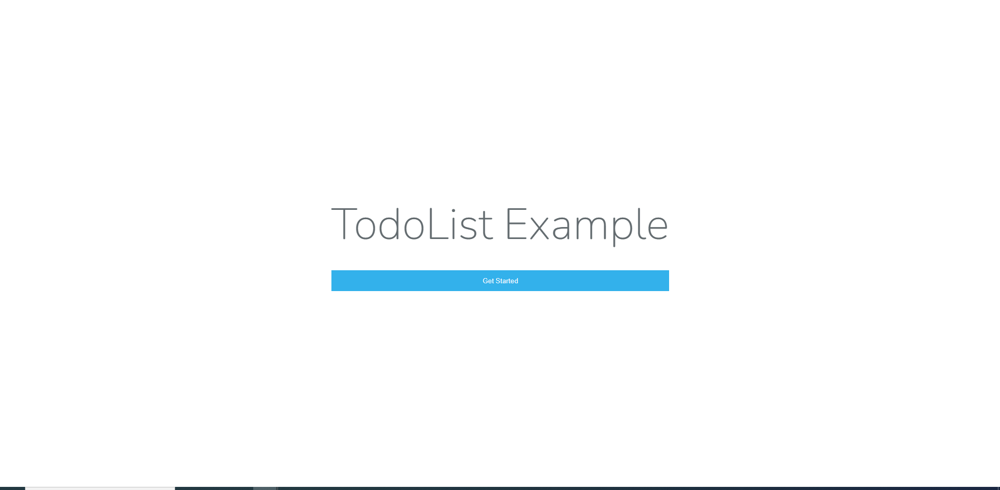
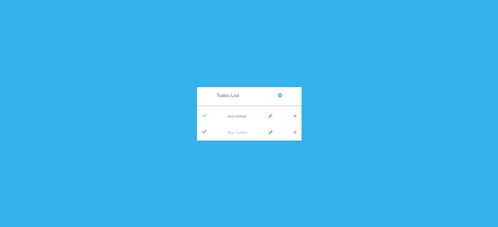
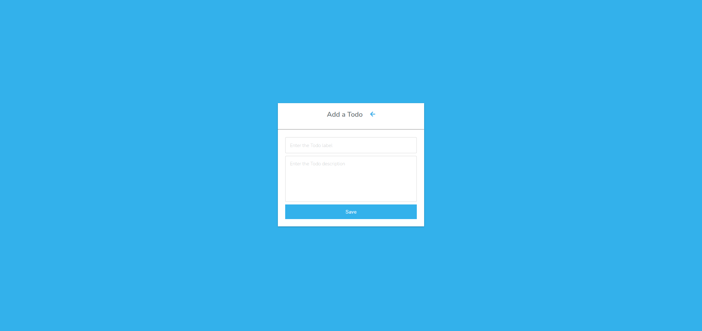
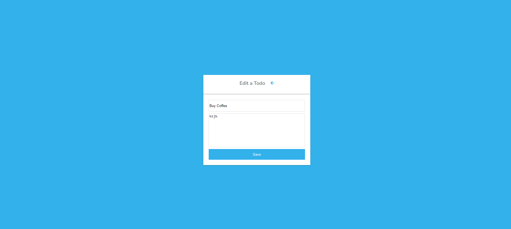

# LaraTodo
This is a simple TodoList written just in php(Laravel)









# Installation


```sh
1)Install Composer In Your PC

2)Clone Or Download The Repository

3)Goto The Repository and Open a Terminal Enter Following Commands 
    composer install
    
4)Execute the Following Command
    copy .env.example .env (for Windows)
    php artisan generate:key
    php artisan migrate
    php artisan serve
    
5)Enjoy !!!
```


Verify the deployment by navigating to your server address in
your preferred browser.

```sh
127.0.0.1:8000
```


