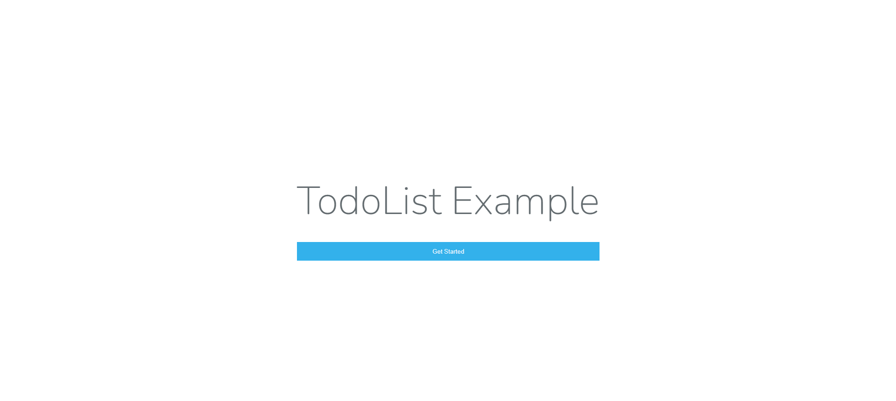

# LaraTodo
This is a simple TodoList written just in php(Laravel)




# Installation


```sh
1)Install Composer In Your PC

2)Clone Or Download The Repository

3)Goto The Repository and Open a Terminal Enter Following Commands 
    composer install

4)Add the .env File(You Can Find It In The Internet)

5)Set the .env File with the relevant configuration

6)Execute the Following Command
    php artisan generate:key
    php artisan migrate
    php artisan serve
    
7)Enjoy !!!
```


Verify the deployment by navigating to your server address in
your preferred browser.

```sh
127.0.0.1:8000
```


